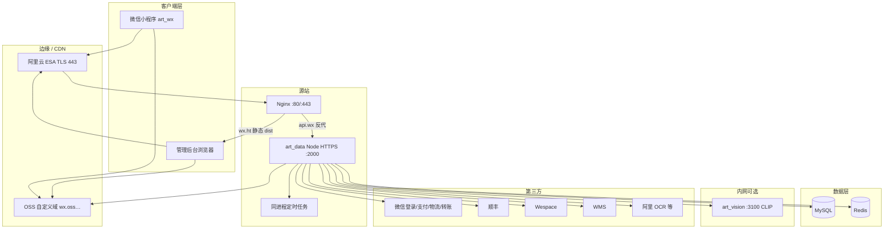
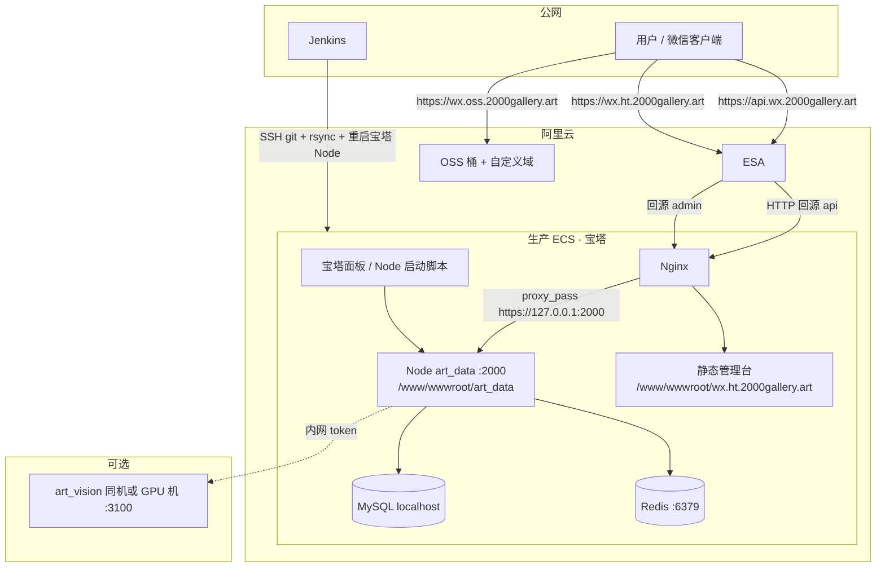

# 系统架构图 / 物理架构图

形态：**单机宝塔 ECS + Jenkins SSH 部署**（宝塔 Node 项目，非 PM2）。管理台为静态文件，API 为同机 HTTPS 进程；小程序无服务端进程。

相关：[`BUSINESS-FLOWS.md`](./BUSINESS-FLOWS.md) · [`SEQUENCES.md`](./SEQUENCES.md) · [`COMPONENTS.md`](./COMPONENTS.md) · [`NETWORK.md`](./NETWORK.md) · [发布流程](../deploy/CI-CD.md) · [流水线图](./CICD-FLOW.md)

## 逻辑分层（系统架构）



| 层 | 组件 | 职责 |
|----|------|------|
| 客户端 | `art_wx`、管理台浏览器 | 业务交互；小程序不校验 CORS |
| 边缘 | 阿里云 ESA、`wx.oss.2000gallery.art` | 公网 HTTPS、静态/图床 |
| API | Express `index.js` | 鉴权、计价、支付回调、识图编排、WebView 代理 |
| Jobs | **同进程**定时器 | 数字品同步、WMS、物流通知、佣金结算、订单关闭、识图建索引等 |
| 数据 | MySQL、Redis | 主数据 + 缓存 / 签名防重放 |
| 内网 ML | `art_vision` | 展览 CLIP 检索；失败降级 dHash |
| 第三方 | 微信 / 顺丰 / Wespace / WMS / OCR | 出站 HTTPS |

## 物理部署（主机与域名）



| 角色 | 路径 / 地址 | 端口 |
|------|-------------|------|
| API 进程 | `/www/wwwroot/art_data`，宝塔项目名 `art_data` | HTTPS **2000** |
| Nginx API 站 | `server_name api.wx.2000gallery.art` → `127.0.0.1:2000` | **80**（ESA HTTP 回源） |
| 管理台静态 | `/www/wwwroot/wx.ht.2000gallery.art`（**勿**反代到 :2000） | 80 / 443 |
| MySQL / Redis | 同机 `localhost`（模板） | 3306 / **6379**（DB=2） |
| OSS | `OSS_REGION`（如杭州）；ECS 可走 `-internal` endpoint | 公网域 `wx.oss…` |
| art_vision | `ART_VISION_BASE_URL` 默认 `http://127.0.0.1:3100` | **3100**，勿对公网开放 |
| Jenkins | Deploy：build → rsync 管理台 → SSH 同步 API → 重启 → smoke | 自建 Agent |

| 域名 | 用途 | 回源 |
|------|------|------|
| `api.wx.2000gallery.art` | 业务 API | ESA → Nginx:80 → Node:2000 |
| `wx.ht.2000gallery.art` | 管理后台 | ESA → Nginx 静态 `dist/` |
| `wx.oss.2000gallery.art` | 图片 / 二维码等 | 阿里云 OSS |

## 信任边界

```text
公网用户 / 微信
    │ HTTPS 443
    ▼
① 阿里云 ESA（边缘 TLS、缓存）
    │ HTTP:80 回源（api）
    ▼
② 源站 Nginx（vhost / 反代）
    │ https://127.0.0.1:2000
    ▼
③ Node art_data（JWT / API 签名 / rate limit / trust proxy）
    ├─ localhost MySQL / Redis
    ├─ 出站：微信 · 顺丰 · Wespace · WMS · OSS · OCR …
    └─ ④ art_vision :3100 + INTERNAL_TOKEN（不对小程序暴露）
```

运维面（SSH、宝塔面板、`.env`）不在小程序可达路径内。小程序合法域名只配 `api.wx` / `wx.oss` 等，**禁止**写成 `:2000`。完整端口与边界见 [`NETWORK.md`](./NETWORK.md)。

## 进程与制品拓扑

| 制品 | 仓库 | 部署 | 说明 |
|------|------|------|------|
| API 进程 | `art_data` | 宝塔 `node index.js` | 内嵌全部定时任务 |
| 管理台静态 | `art_data` `vite build` → `dist/` | Jenkins rsync | Nginx 纯静态 |
| 小程序 | `art_wx` | 上传体验版 → 人工提审 | 无服务器进程 |
| 识图 | `art_vision` | 同机或 GPU 机 | 可选；失败 dHash 回退 |

发布顺序：可选先 `art_vision` → **先** `art_data` Deploy + smoke → **再** `art_wx` 体验版 → 微信正式版。详见 [deploy/CI-CD.md](../deploy/CI-CD.md)。

## 同进程定时 / 启动任务（节选）

`startDigitalArtworksSync` · `startWmsProductSyncSchedule` · `startPaymentPendingReminderScheduler` · `startLogisticsPathNotifyScheduler` · `startCommissionSettlementScheduler` · `startReferralReconciliationScheduler` · `startOrderAutoCloseScheduler` · `startExhibitionVisionIndexBootstrap`
