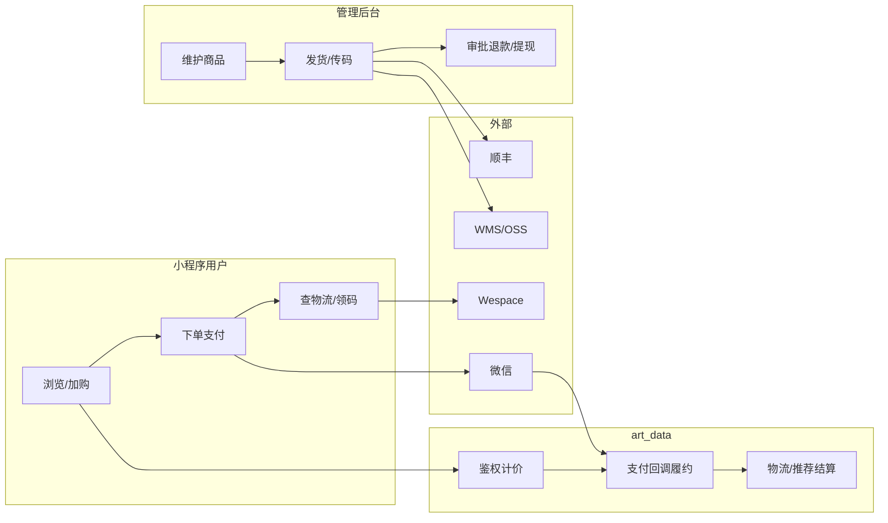
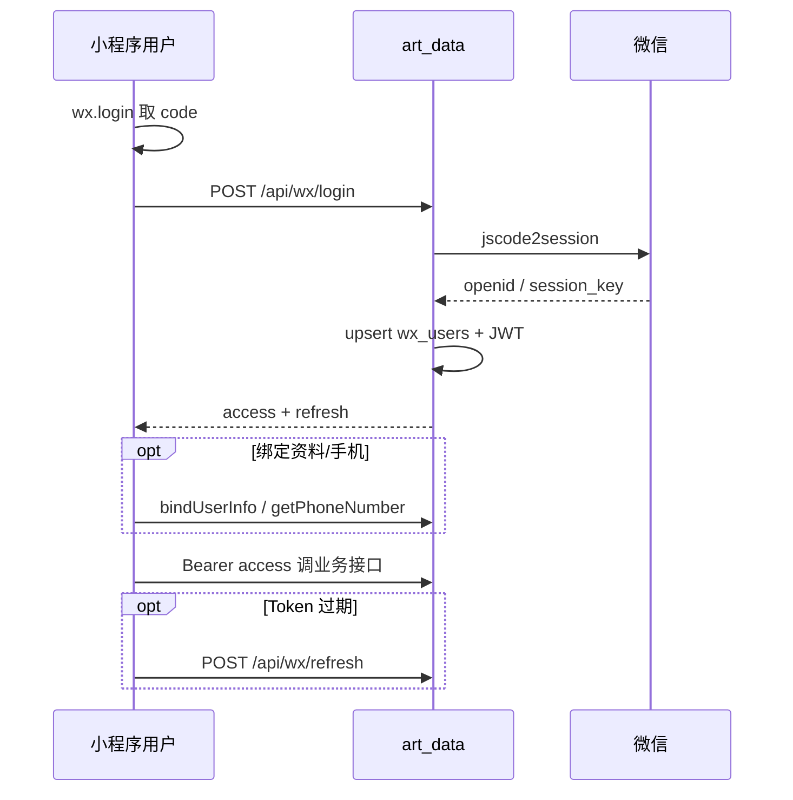
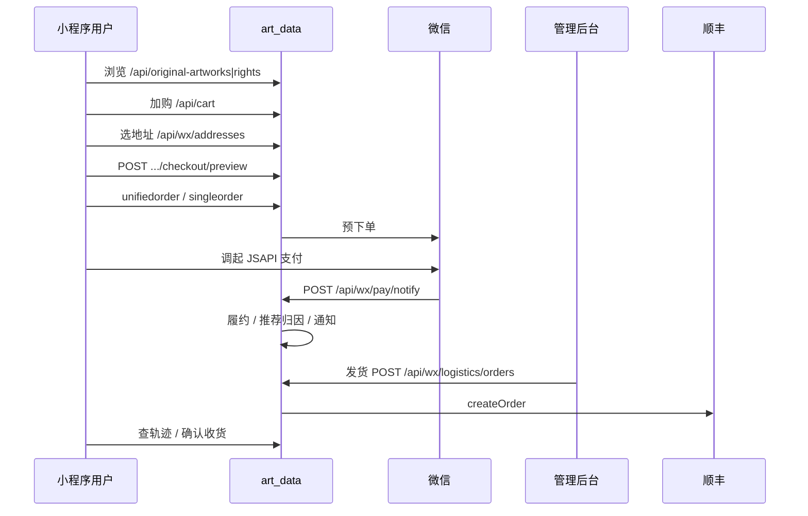
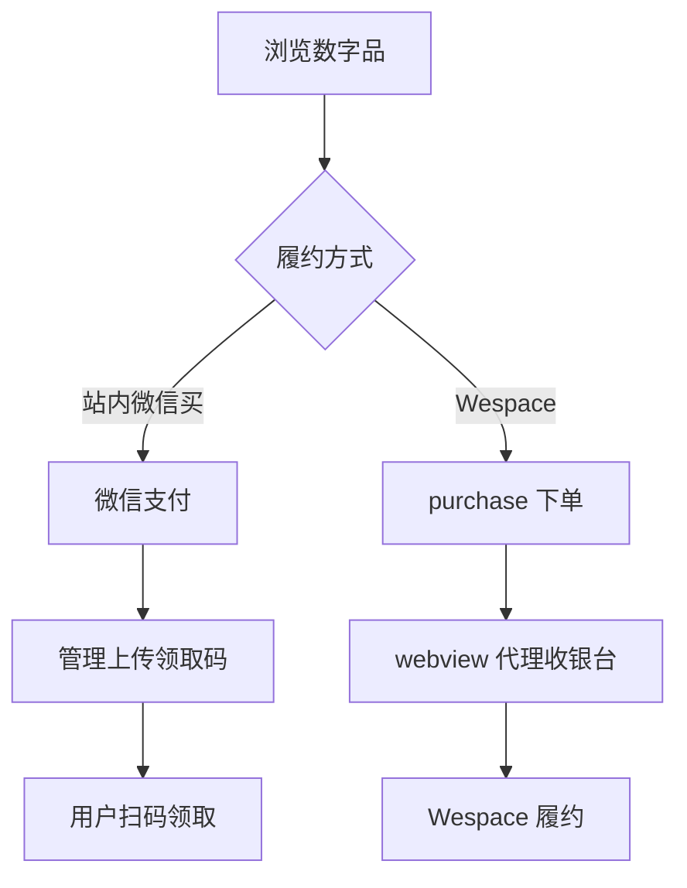
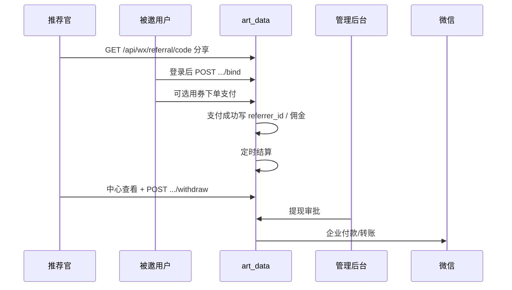

# 业务流程图 / 泳道图

仓库协作：`art_data` = Express API + Vue 管理后台；`art_wx` = 微信小程序；`art_vision` = 展览识图（内网）。

相关：[`SEQUENCES.md`](./SEQUENCES.md) · [`USE-CASES.md`](./USE-CASES.md) · [`STATE-MACHINES.md`](./STATE-MACHINES.md) · [`ARCHITECTURE.md`](./ARCHITECTURE.md) · [`COMPONENTS.md`](./COMPONENTS.md) · [接口文档](./PROJECT-API.md)

## 泳道角色

| 泳道 | 职责 | 关键落点 |
|------|------|----------|
| 小程序用户 | 浏览、下单、领取、推荐 | `art_wx` → `/api/wx/*` |
| 管理后台运营 | 商品、订单、履约、审核 | `src/views` → `requireAdmin` |
| art_data 后端 | 鉴权、计价、库存、编排 | `routes/` + `services/` |
| 微信 | 登录、JSAPI 支付、发货录入、转账 | `jscode2session` / pay notify |
| Wespace | 数字品链上 / 收银台 | `digital-artworks` + `webview` |
| 顺丰 | 下单、轨迹 | `logisticsService` / `sfExpress*` |
| WMS | 原作主档同步 | `wmsProductSyncService` |
| OSS | 图片 / 二维码存储 | `upload` / ali-oss |

## 总览

## ① 用户登录（小程序）

管理端并行：`Login.vue` → `POST /api/auth/login` → admin JWT。

## ② 实物下单支付

商品类型 `artwork` / `right`，须带 `address_id`。

## ③ 数字藏品购买 / 领取

两条支线：

**A · 微信 JSAPI + 站内二维码**

1. 浏览数字品 → 下单 `type=digital`（可无发货地址）
2. 支付成功 → 订单「待上传二维码」
3. 管理端 `PATCH .../items/:id/qr-code`（常经 OSS）
4. 用户在订单 / 资产内扫码领取；文案见 `/api/digital-claim-copy`

**B · Wespace WebView 收银台**

1. 详情带 `goodsVerId` / `usn` 校验
2. `POST /api/digital-artworks/order/purchase`
3. 返回收银台 URL → `POST /api/auth/url-access` + `GET /api/webview/proxy`
4. Wespace 侧完成支付与链上履约

## ④ 推荐官邀请与奖励

## ⑤ 管理后台发货 / 履约

| 类型 | 步骤 |
|------|------|
| 实物 | `Orders.vue` → `GET .../admin/orders` → `POST /api/wx/logistics/orders`（顺丰）→ `order_shipments` → 可选微信发货录入 → 用户查轨迹 |
| 数字码 | 同订单页上传 `qr-code`（衔接支线 A） |
| 辅线 | WMS 同步原作、退款审批、推荐提现审批 |

## 业务域与路由挂载

| 域 | 路由前缀 |
|----|----------|
| 鉴权 | `/api/auth`、`/api/wx/login`、`/api/wx/refresh` |
| 内容 | `/api/original-artworks`、`/api/digital-artworks`、`/api/rights`、`/api/exhibitions` |
| 交易 | `/api/cart`、`/api/wx/pay/*`、`/api/wx/addresses` |
| 物流 | `/api/wx/logistics*` |
| 推荐 | `/api/wx/referral/*`、`/api/admin/referral/*` |
| 代理 | `/api/webview` |
| 对接 | `/api/external`、`/api/issuance`、`/api/upload` |
