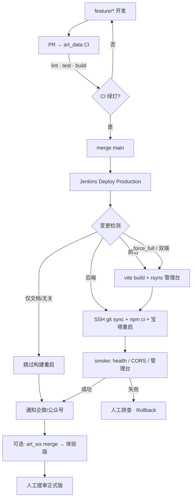
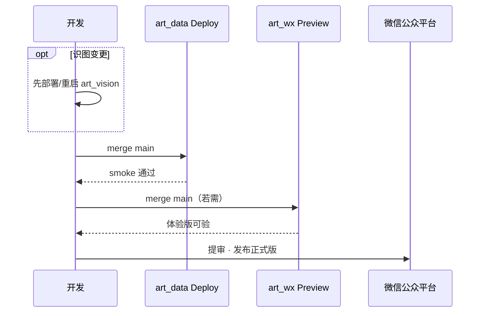

# CI/CD 流水线

操作细则与 Credentials 见 [deploy/CI-CD.md](../deploy/CI-CD.md)。本文只给流程图。

## 仓库分工

| 仓库 | 产物 | Jenkins Job |
|------|------|-------------|
| `art_data` | API 进程 + 管理台 `dist/` | CI · Deploy · Rollback · Release · Audit |
| `art_wx` | 小程序体验版 | `art_wx-ci` · `art_wx-deploy` |
| `art_vision` | 识图服务（可选） | 独立部署 |

## 主路径

## 发布硬顺序

## Deploy 步骤（art_data）

1. Checkout · 检测 FE/BE 路径变更（手动可勾选 `FORCE_FULL`）
2. 前端有变更：`npm ci` + `vite build` → rsync → `ADMIN_DEPLOY_PATH`
3. 后端有变更：SSH 同步代码 · `npm ci` · 宝塔 Node 重启
4. Smoke：`API_BASE_URL` / `ADMIN_BASE_URL`
5. 通知：`WECOM_WEBHOOK_URL` / 公众号模板（链接为 Jenkins `BUILD_URL`）

回滚：Jenkins Job `art_data-rollback` → 输入 tag 或 commit SHA。

## 与架构文档

物理机路径与域名：[ARCHITECTURE.md](./ARCHITECTURE.md) · 组件边界：[COMPONENTS.md](./COMPONENTS.md)。
