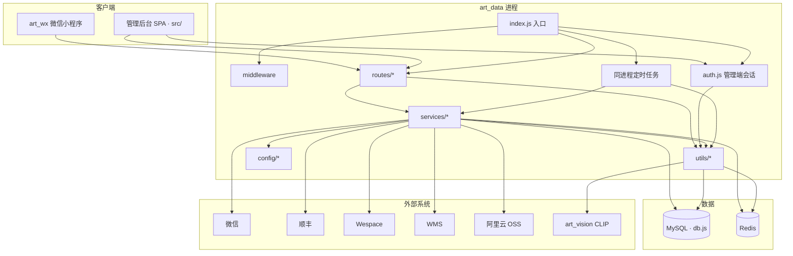
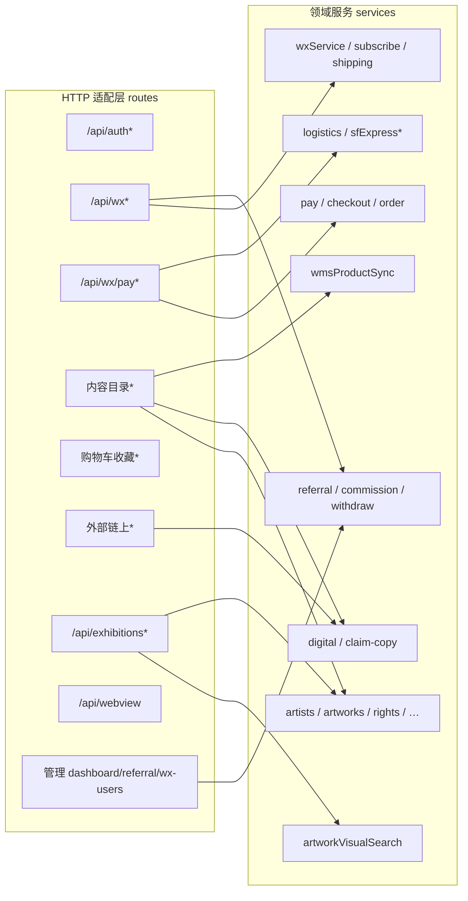
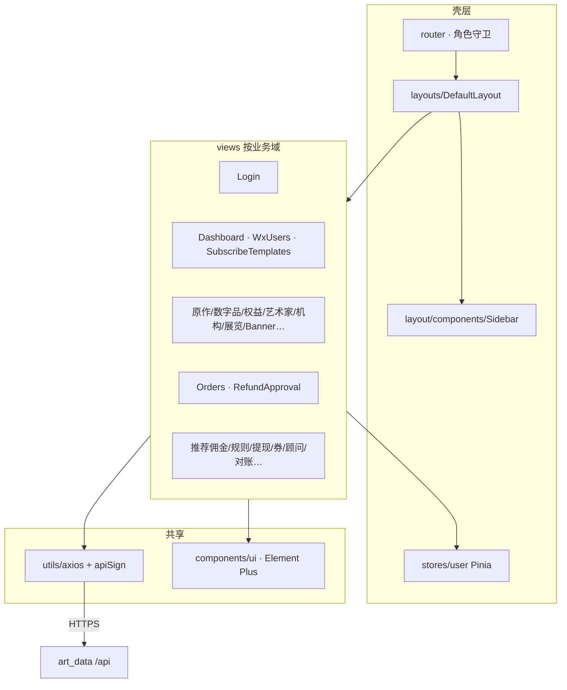

# 组件图 / 模块结构图

本仓库 `art_data` 的逻辑组件与目录模块关系。物理部署见 [`ARCHITECTURE.md`](./ARCHITECTURE.md)，端到端业务见 [`BUSINESS-FLOWS.md`](./BUSINESS-FLOWS.md)，调用时序见 [`SEQUENCES.md`](./SEQUENCES.md)。

## 组件依赖总览



| 组件 | 路径 | 职责 |
|------|------|------|
| 入口 | `index.js` | Helmet / CORS / 限流 / 挂载路由 / 启动定时任务 / HTTPS :2000 |
| 管理端鉴权 | `auth.js` | 注册登录、admin JWT、`authenticateToken` / `requireAdmin` |
| 路由 | `routes/` | HTTP 适配；薄层，域逻辑下沉 `services/` |
| 领域服务 | `services/` | 计价支付、物流、推荐、WMS、识图编排、消息等 |
| 横切 | `middleware/` | 请求上下文、API 签名、CORS、上传、WebView access |
| 共享工具 | `utils/` | 会话、Redis、OSS/图、第三方 HTTP 客户端、Schema ensure、同步 |
| 配置 | `config/` | OSS、WMS、multer、公网 URL、订阅模板等 |
| 数据 | `db.js` + Redis | MySQL 连接池；缓存 / 签名 nonce |

## 后端模块结构



### 路由域 → 挂载前缀

| 域 | 主要文件 | 前缀 |
|----|----------|------|
| 管理鉴权 | `auth.js`（根目录） | `/api/auth` |
| 小程序账号/地址/物流嵌入 | `routes/wx.js` | `/api/wx` |
| 推荐 C 端 | `routes/referral.js`（经 wx） | `/api/wx/referral` |
| 支付订单 | `routes/pay.js` | `/api/wx/pay` |
| 推荐管理 | `routes/adminReferral.js` | `/api/admin/referral` |
| 微信用户管理 | `routes/adminWxUsers.js` | `/api/admin/wx-users` |
| 内容目录 | `artists` · `artworks` · `digital-artworks` · `rights` · `physical-categories` · `institutions` · `banners` · `home-titles` · `showcase` · `search` · `merchants` | `/api/...` |
| 电商辅线 | `cart` · `favorites` · `user` · `upload` · `dashboard` | `/api/...` |
| 链上 / Wespace | `external-api` · `issuance` · `asset-transfer` · `asset-verify` · `transaction` | `/api/...` |
| 展览识图 | `exhibitions.js` | `/api/exhibitions` |
| WebView 代理 | `webview.js` | `/api/webview` |
| 领取文案 | `digital-claim-copy.js` | `/api/digital-claim-copy` |

### 服务域（节选）

| 域 | 代表模块 |
|----|----------|
| 支付履约 | `payService` · `checkoutPricing` · `orderAutoCloseScheduler` |
| 物流顺丰 | `logisticsService` · `sfExpress*` · `logisticsPathNotify` · `wechatShippingInfoService` |
| 推荐激励 | `referralService` · `commissionService` · `withdrawService` · `wechatTransferService` · `*Scheduler` |
| 内容 CRUD | `artistsService` · `artworksService` · `rightsService` · `exhibitionsService` · … |
| 数字品 | `digitalClaimCopyService` · `utils/digitalArtworksSync` |
| WMS | `wmsProductSyncService` · `wmsArtworkImageService` |
| 识图 | `artworkVisualSearchService` ← `utils/artVisionClient`（CLIP）+ dHash |
| 微信能力 | `wxService` · `subscribeMessage*` · `mapGeocodeService` |

### 中间件与横切

| 模块 | 作用 |
|------|------|
| `middleware/corsPolicy` | 允许源 + 预检 |
| `middleware/requestContext` | `X-Request-Id` / ALS |
| `middleware/apiRequestSign` | HMAC 签名 + Redis nonce |
| `middleware/localUploads` | 鉴权/签名后提供 `/uploads` |
| `middleware/webviewAccess` | WebView 短期 access |
| `helmet` · `express-rate-limit` | 安全头 / 限流（`index.js`） |

### 同进程 Job（由 `index.js` 启动）

`digitalArtworksSync` · `wmsProductSync` · `paymentPendingReminder` · `logisticsPathNotify` · `commissionSettlement` · `referralReconciliation` · `orderAutoClose` · `exhibitionVisionIndexBootstrap`

## 管理后台模块结构（`src/`）



| 域 | 主要视图 |
|----|----------|
| 鉴权 | `Login` |
| 运营 | `Dashboard` · `WxUsers` · `SubscribeMessageTemplates` |
| 目录 | `OriginalArtworks` · `DigitalArtworks` · `DigitalClaimCopy` · `Rights` · `Artists` · `Institutions` · `Exhibitions` · `Banners` · `Merchants` · `PhysicalCategories` … |
| 订单 | `Orders` · `RefundApproval` · `DigitalIdentityPurchases` |
| 推荐 | `ReferralCommissions` · `CommissionRules` · `ReferralWithdrawals` · `ReferralCoupons` · `ReferralAdvisorApplications` · `ReferralVipEarlyAccess` · `ReferralShareEvents` · `ReferralReconciliation` |

说明：前端无独立 `src/api/`；页面经 `utils/axios.js`（含 `apiSign`）直调后端。

## 仓库目录一览

```text
art_data/
├── index.js              # Express 入口 + Jobs
├── auth.js               # 管理端会话
├── db.js                 # MySQL
├── routes/               # HTTP 路由
├── services/             # 领域服务
├── middleware/           # CORS / 签名 / 上传 / WebView
├── utils/                # 客户端、Schema、同步、会话
├── config/               # OSS / WMS / 环境常量
├── src/                  # 管理后台 Vue
│   ├── views/
│   ├── router/
│   ├── layouts/ · layout/
│   ├── stores/
│   ├── components/
│   └── utils/
├── deploy/               # CI/CD · Nginx 示例
└── docs/                 # API · 架构 · 业务流 · 本文
```

## 与其它仓库的组件边界

| 仓库 | 角色 | 对接面 |
|------|------|--------|
| `art_wx` | 小程序客户端 | `/api/wx*`、支付、内容、展览识图等；无服务端进程 |
| `art_vision` | 内网 CLIP（可选） | `utils/artVisionClient` → `:3100/internal/*`；失败由 `artworkVisualSearchService` dHash 回退 |
| 第三方 | 微信 / 顺丰 / Wespace / WMS / OSS | 经 `services/` 与 `utils/*Client` 出站 |
