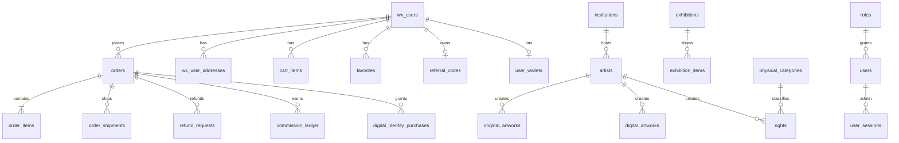
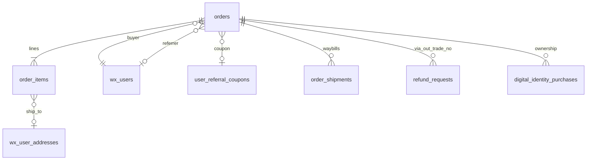
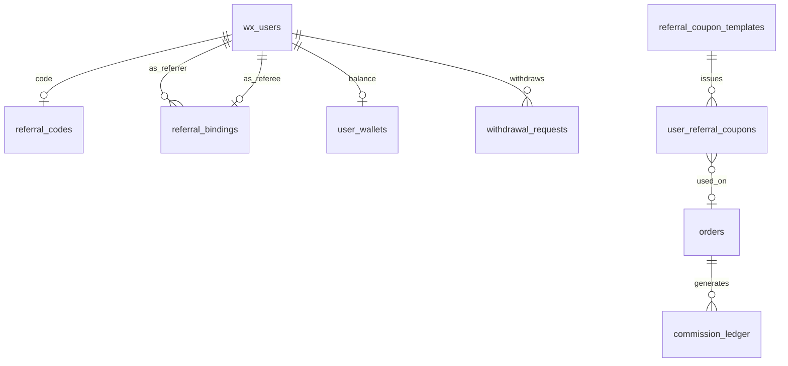

# 数据模型 / ER

逻辑外键为主（多数表无 MySQL `CONSTRAINT`）。DDL 分散在 `schema.sql`（基线）与 `utils/*Schema.js` ensure。状态枚举详见 [`STATE-MACHINES.md`](./STATE-MACHINES.md)。

## 域总览

## 用户与会话

| 表 | PK | 关系 |
|----|-----|------|
| `roles` | `id` | `admin` / `user` |
| `users` | `id` | `role_id` → roles |
| `user_sessions` | `id` | 管理端 JWT 会话 |
| `wx_users` | `id` | UK `openid`；`user_tier` |
| `wx_user_sessions` / `wx_refresh_tokens` | `id` | → `wx_users` |
| `wx_user_addresses` | `id` | → `wx_users` |

## 商品目录

| 表 | 关系 |
|----|------|
| `institutions` → `artists` | 机构下艺术家 |
| `original_artworks` | `artist_id` |
| `digital_artworks` / `digital_artworks_external` | 本地目录 / Wespace 同步 |
| `physical_categories` → `rights` | 实物权益品 |
| `right_images` · `right_discount_eligibles` | 图集 / 数字联名折扣 |
| `exhibitions` → `exhibition_items` | `artwork_type`+`artwork_id` 多态 |
| `exhibition_item_artists` · `exhibition_live_photos` | 参展艺术家 / 现场图 |
| `banners` · `merchants` (+ images) | 运营位 / 商家 |

`order_items.type` / `cart_items.type`：`right` | `digital` | `artwork`。

## 交易与履约

| 表 | 要点 |
|----|------|
| `orders` | UK `out_trade_no`；`trade_state`；`inventory_reserved`；推荐快照 |
| `order_items` | SKU 行；数字履约 `delivery_qr_code_url` / `_at` |
| `order_shipments` | `order_id`；`status` active/cancelled；路径 action |
| `refund_requests` | 逻辑关联 `out_trade_no` |
| `digital_identity_purchases` | 支付成功所有权行；退款删除；无 status 列 |
| `cart_items` · `favorites` | 用户购物车 / 多态收藏 |

## 推荐与资金

| 表 | 要点 |
|----|------|
| `referral_bindings` | referee 唯一；`source` link/code/poster；`expires_at` 为 NULL 表示永久有效 |
| `commission_ledger` | UK per order item；`pending|settlable|withdrawn|cancelled` |
| `commission_rate_rules` | 按 `product_type` |
| `user_wallets` | pending / available |
| `withdrawal_requests` | 提现单 |
| `referral_bonus_grants` · coupons · `art_advisor_applications` | 奖励 / 券 / 顾问申请 |
| `share_events` | 分享埋点 |

## 管理端

`users` ⋈ `roles` ← `user_sessions`；顾问审核 `art_advisor_applications.reviewed_by` → `users.id`。

## 说明

- 库存占用：`orders.inventory_reserved` + 支付成功扣减（商品表库存字段）。
- 数字目录与 Wespace：`digital_artworks_external` 为同步主档之一；下单仍落本地 `orders`。
- 完整列级以运行时 ensure 与 `schema.sql` 为准；本文只保核心关系。
