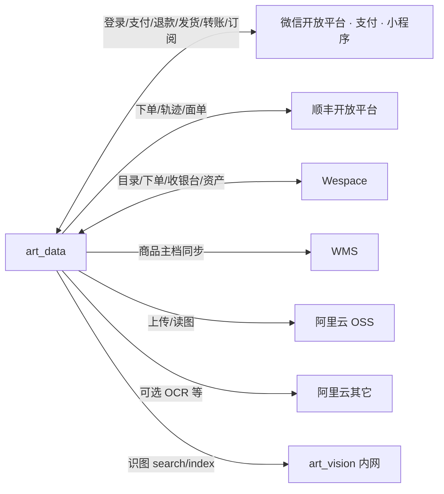

# 第三方集成图

出站能力与入站回调入口。进程内模块见 [`COMPONENTS.md`](./COMPONENTS.md)，网络边界见 [`NETWORK.md`](./NETWORK.md)。

## 总览

## 对接清单

| 系统 | 方向 | 主要用途 | 代码落点 | 回调 / 入口 |
|------|------|----------|----------|-------------|
| 微信小程序登录 | 出 | `jscode2session` | `wxService` | — |
| 微信支付 JSAPI | 出+入 | 预下单、查单、关单 | `payService` | `POST /api/wx/pay/notify` |
| 微信退款 | 出+入 | 退款申请 | `payService` | `POST /api/wx/pay/refund/notify` |
| 微信发货录入 | 出 | 物流信息上报 | `wechatShippingInfoService` | — |
| 商家转账 | 出+入 | 推荐提现 | `wechatTransferService` / `withdrawService` | `POST /api/wx/referral/withdraw/notify` |
| 订阅消息 | 出 | 支付/物流/虚拟发货催付 | `subscribeMessage*` | — |
| 顺丰 | 出 | 下单、改单、轨迹、面单 | `sfExpress*` / `logisticsService` | —（轨迹多为主动拉） |
| Wespace | 出 | 数字品目录、purchase、资产代理 | `digital-artworks` · `external-api` · `wespaceHttp` | 资产 webhook（`asset-transfer` 等） |
| WMS | 出 | 原作主档定时同步 | `wmsProductSyncService` | — |
| OSS | 出 | 图片、二维码 | `config/oss` · `upload` | 公网域 `wx.oss…` |
| art_vision | 出 | CLIP 检索 / 建索引 | `artVisionClient` | **不对公网**；`INTERNAL_TOKEN` |
| 地图地理编码 | 出 | 地址解析 | `mapGeocodeService` | — |

## 入站回调（须在公网可达）

| Path | 发送方 | 保护 |
|------|--------|------|
| `/api/wx/pay/notify` | 微信支付 | 平台证书验签 + 资源解密；raw body |
| `/api/wx/pay/refund/notify` | 微信退款 | 同上 |
| `/api/wx/referral/withdraw/notify` | 商家转账 | 平台验签 |
| 资产相关 webhook（若启用） | Wespace 等 | 按路由校验 |

管理端 / 小程序业务 API：JWT +（管理台）HMAC API 签名 + Redis nonce。详见安全文档与 `middleware/apiRequestSign`。

## 配置面（环境变量族）

| 族 | 示例前缀 | 备注 |
|----|----------|------|
| 微信小程序 / 支付 | `WX_` · `WECHAT_PAY_` | 商户号、证书、notify 域名须为 `api.wx…` |
| 顺丰 | `SF_` | 顾客编码、校验码、环境 |
| Wespace | `WESPACE_` | Base URL、密钥；TLS 策略受控 |
| WMS | `WMS_` | HTTP / 七牛相关见 `config/` |
| OSS | `OSS_` | Region、Bucket、自定义域 |
| art_vision | `ART_VISION_` | `ENABLED` · `BASE_URL` · `INTERNAL_TOKEN` |

密钥只存服务器 `.env` / GitHub Secrets，不进仓库。
