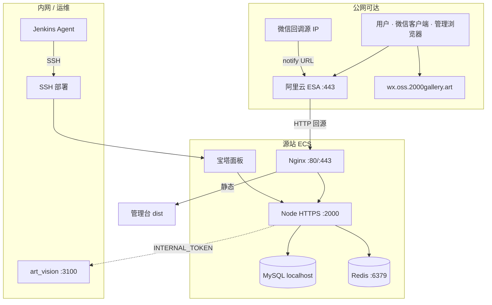

# 网络与信任边界

物理拓扑见 [`ARCHITECTURE.md`](./ARCHITECTURE.md)。本文细化可达面、端口与客户端配置约束。

## 边界分层

## 域名与回源

| 域名 | 谁访问 | 链路 | 备注 |
|------|--------|------|------|
| `api.wx.2000gallery.art` | 小程序、管理台、微信回调 | ESA → Nginx:80 → `127.0.0.1:2000` | 合法 request 域名；**禁止**写 `:2000` |
| `wx.ht.2000gallery.art` | 运营浏览器 | ESA → Nginx 静态 | **勿**反代到 API 端口 |
| `wx.oss.2000gallery.art` | 全端读图 | OSS 自定义域 | downloadFile 合法域名 |

## 端口矩阵

| 端口 | 监听 | 公网 | 说明 |
|------|------|------|------|
| 443 | ESA / 可选源站 TLS | 是 | 用户入口 |
| 80 | Nginx（ESA HTTP 回源） | 经 ESA | api / admin vhost |
| 2000 | Node HTTPS | **否**（仅本机反代） | 宝塔项目 |
| 3306 | MySQL | **否** | localhost |
| 6379 | Redis DB=2 | **否** | localhost |
| 3100 | art_vision | **否** | 内网 + token |
| 宝塔面板端口 | 面板 | 强限制 / VPN | 运维面 |
| 22 | SSH | 白名单 / 密钥 | Jenkins 部署 |

## 信任控制点

| # | 位置 | 控制 |
|---|------|------|
| ① | ESA | TLS 终结、缓存、回源协议 |
| ② | Nginx | `server_name`、反代、静态根目录 |
| ③ | Node | `trust proxy`、Helmet、限流、JWT、API 签名、回调验签 |
| ④ | art_vision | 仅内网；`ART_VISION_INTERNAL_TOKEN` |
| ⑤ | 运维 | SSH 密钥、宝塔、`.env` —— **不在**小程序可达路径 |

## 客户端合法域名（微信）

须配置：`api.wx.2000gallery.art`、`wx.oss.2000gallery.art`（及业务需要的 web-view / uploadFile 域）。  
WebView 收银台等走 `/api/webview/proxy` + 域名白名单策略（`proxyUrlPolicy`）。

## 相关

对接回调路径：[INTEGRATIONS.md](./INTEGRATIONS.md) · CORS：[deploy/CDN-API-CORS.md](../deploy/CDN-API-CORS.md)
