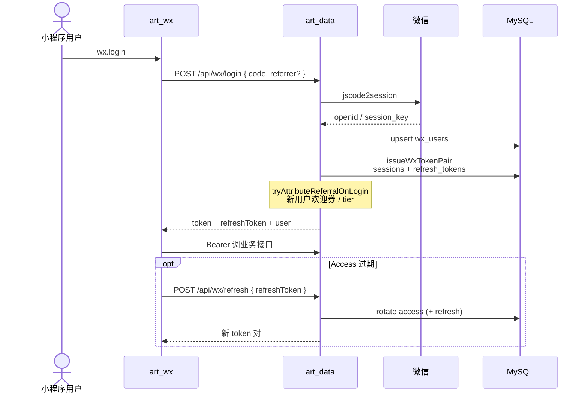
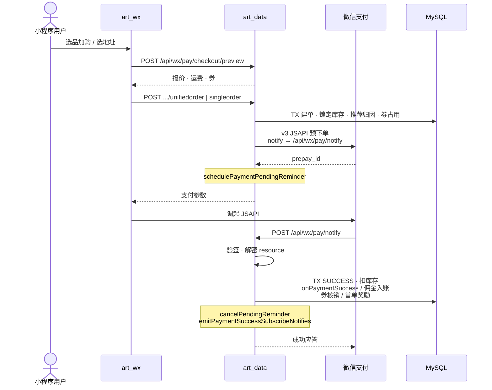
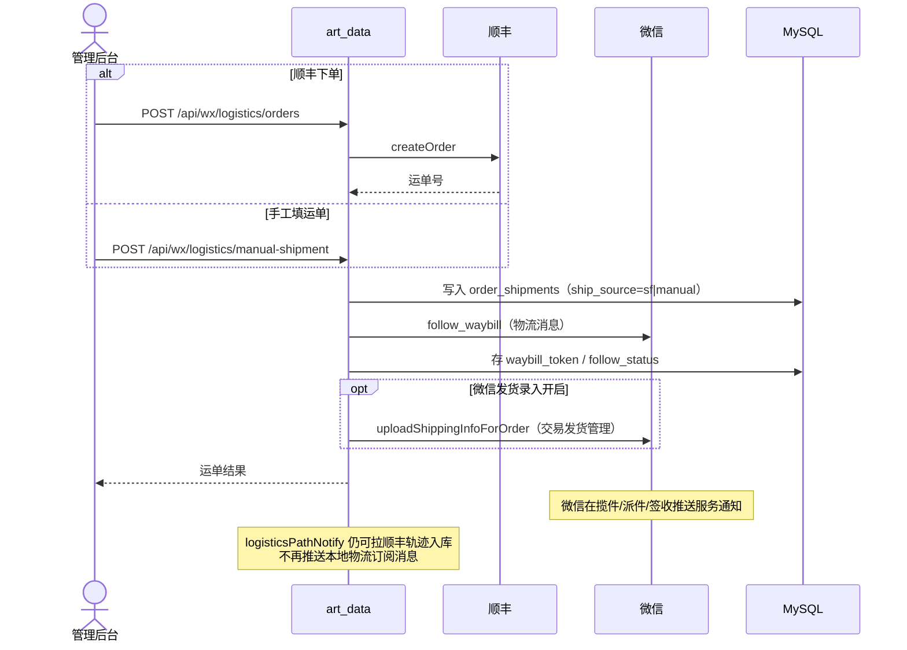
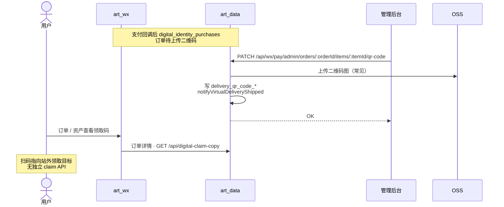
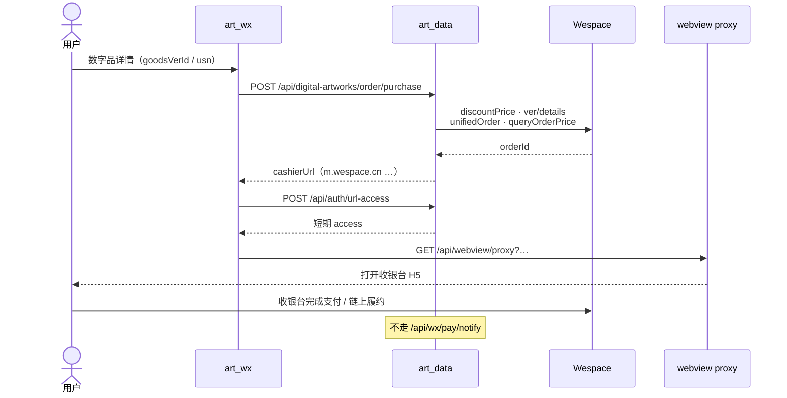
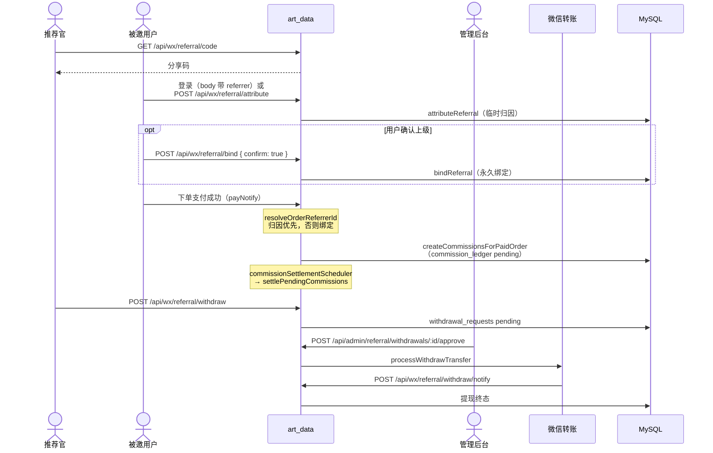
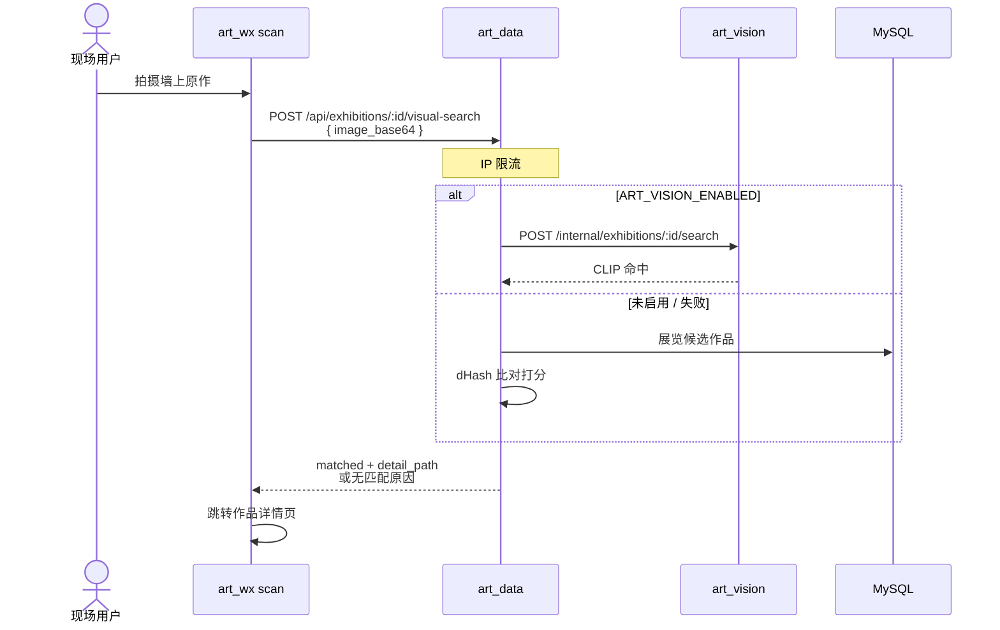
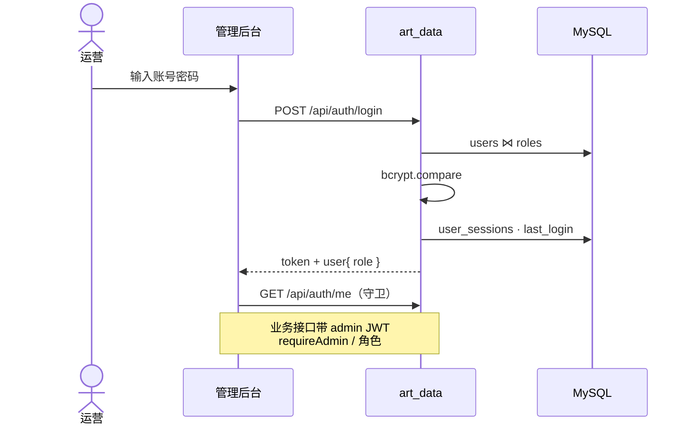

# 时序图

端到端调用时序（参与者、接口路径、关键副作用）。业务泳道见 [`BUSINESS-FLOWS.md`](./BUSINESS-FLOWS.md)，状态迁移见 [`STATE-MACHINES.md`](./STATE-MACHINES.md)，组件边界见 [`COMPONENTS.md`](./COMPONENTS.md)。

## 目录

1. [小程序登录 / Refresh](#1-小程序登录--refresh)
2. [实物下单 · JSAPI · 支付回调](#2-实物下单--jsapi--支付回调)
3. [管理端发货（顺丰 / 手工运单）](#3-管理端发货顺丰--手工运单)
4. [数字品：站内购码 vs Wespace](#4-数字品站内购码-vs-wespace)
5. [推荐绑定 · 佣金 · 提现](#5-推荐绑定--佣金--提现)
6. [展览扫画识图](#6-展览扫画识图)
7. [管理端登录](#7-管理端登录)

---

## 1. 小程序登录 / Refresh

**代码：** `routes/wx.js` → `wxService` → `wxSessionTokens`

---

## 2. 实物下单 · JSAPI · 支付回调

商品类型 `artwork` / `right`，须带地址。**代码：** `routes/pay.js` → `checkoutPricing` / `payService`

支付成功后的异步/定时：订阅消息（含延迟重试）、`commissionSettlementScheduler` 结算到钱包、未支付订单由 `orderAutoCloseScheduler` 关闭。

---

## 3. 管理端发货（顺丰 / 手工运单）

**前提：** 订单 `trade_state === SUCCESS`，含实物行与地址。**代码：** `routes/wx.js` → `logisticsService` → `sfExpress*` / `wechatExpressOpenMsgService`

---

## 4. 数字品：站内购码 vs Wespace

### A · 微信 JSAPI + 管理上传领取码

支付链路同 §2（`type=digital`，地址可无）。履约差异：

### B · Wespace WebView 收银台

**代码：** `routes/digital-artworks.js` · `webview` · `urlAccessToken`

---

## 5. 推荐绑定 · 佣金 · 提现

**挂载：** `/api/wx/referral/*`（经 `wx.js`）、`/api/admin/referral/*`

---

## 6. 展览扫画识图

**代码：** `routes/exhibitions.js` → `artworkVisualSearchService` → `artVisionClient` / dHash

索引侧（非用户请求路径）：展览发布/改作品 → `exhibitionVisionIndex` 防抖 → `art_vision` `/internal/.../index`；启动时可 `exhibitionVisionIndexBootstrap`。

---

## 7. 管理端登录

**代码：** `index.js` + `auth.js`

---

## 与定时任务的衔接（支付后）

| 时机 | 副作用 | 模块 |
|------|--------|------|
| `payNotify` 事务内 | 佣金 ledger、等级、券/首单奖 | `payService` |
| `payNotify` 提交后 | 支付成功订阅消息（含重试） | `emitPaymentSuccessSubscribeNotifies` |
| 进程常驻 | 催付、佣金结算、物流轨迹、推荐对账、订单自动关闭 | `index.js` 启的各 `*Scheduler` |
| 上传数字码后 | 虚拟发货订阅消息 | `uploadDigitalItemQrCode` |
| 顺丰下单后 | follow_waybill（物流消息）+ upload_shipping_info；轨迹由 logisticsPathNotify 同步（不推订阅） | `logisticsService` |
