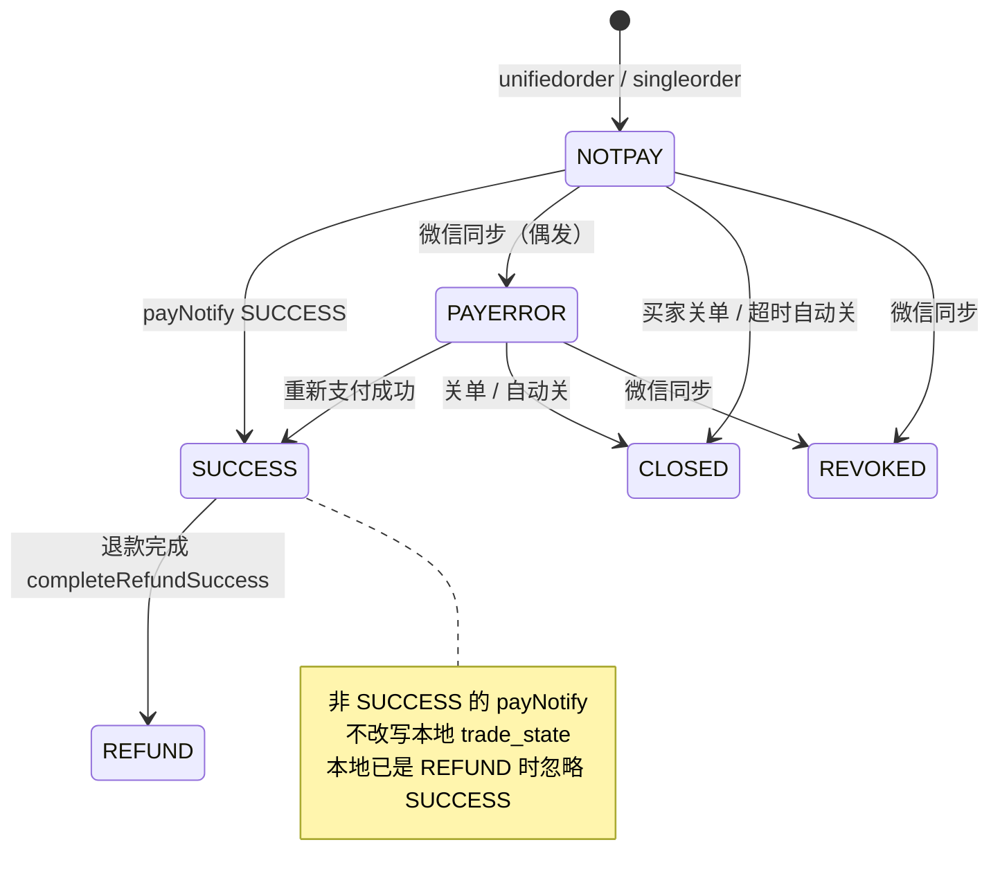
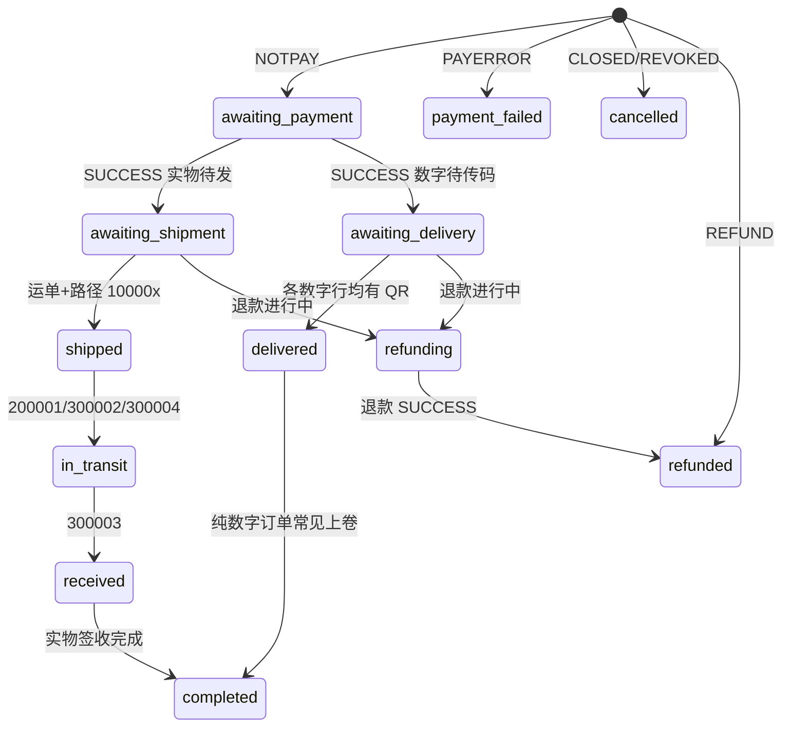
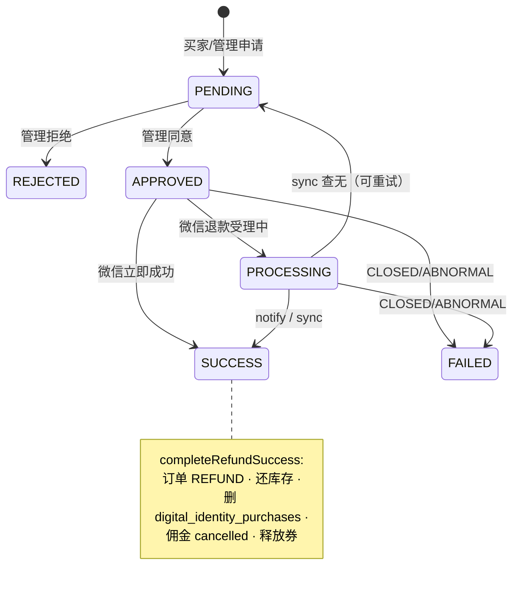
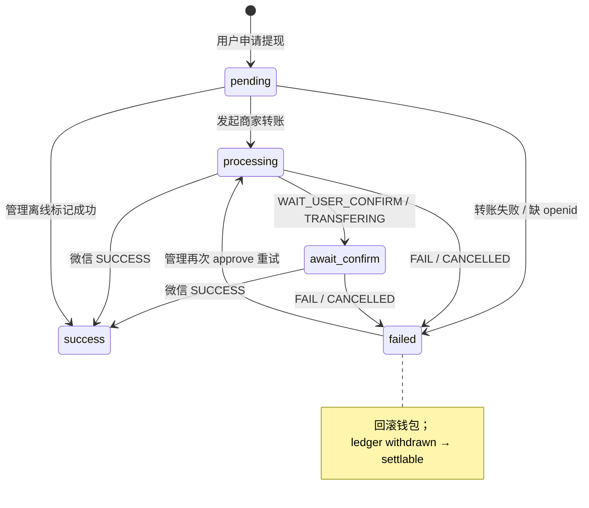
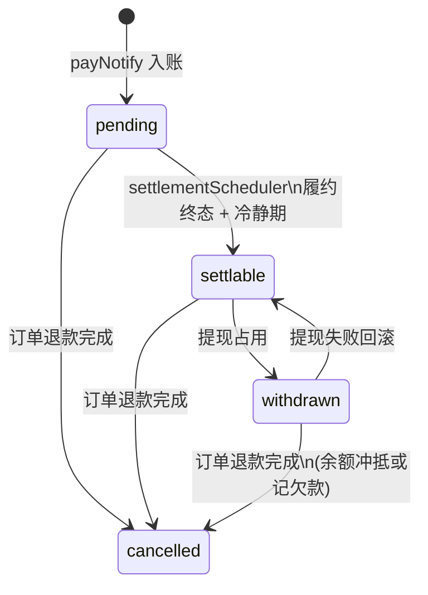

# 状态机

支付态存在 DB；履约多为计算态。时序见 [`SEQUENCES.md`](./SEQUENCES.md)，表关系见 [`DATA-MODEL.md`](./DATA-MODEL.md)。

## 1. 订单支付态 `orders.trade_state`

| 值 | 含义 | 列表别名 |
|----|------|----------|
| `NOTPAY` | 未支付 | pending |
| `PAYERROR` | 支付失败 | pending |
| `SUCCESS` | 支付成功 | completed |
| `CLOSED` | 已关闭 | closed / cancelled |
| `REVOKED` | 已撤销 | cancelled |
| `REFUND` | 已退款 | refunded |

| 触发 | 结果 |
|------|------|
| `POST .../unifiedorder\|singleorder` | 建单 `NOTPAY`，锁库存 |
| `POST /api/wx/pay/notify` SUCCESS | → `SUCCESS` + 履约副作用 |
| 买家 `POST .../close` / `orderAutoCloseScheduler` | 未支付 → `CLOSED` |
| `syncOrderTradeStateFromWechat` | 拉取微信态；**不覆盖**已有 `REFUND` |
| 退款成功 | → `REFUND` |

列表衍生桶：`refunding` = `SUCCESS` + `refund_requests` ∈ `{PENDING,APPROVED,PROCESSING}`。

---

## 2. 履约态（计算，非 DB 列）

源：`utils/orderFulfillmentStatus.js`。由 `trade_state` + 物流/二维码 + 退款行推导。

数字行细粒度（API）：无 QR → `awaiting_qr_code`；有 QR → `delivered`。存在 `order_items.delivery_qr_code_url` / `_at`。

---

## 3. 退款 `refund_requests.status`

`PENDING` · `APPROVED` · `REJECTED` · `PROCESSING` · `SUCCESS` · `FAILED`

进行中拦截新退款：`PENDING|APPROVED|PROCESSING|SUCCESS`。发货拦截：存在 `APPROVED|PROCESSING` 退款。

---

## 4. 提现 `withdrawal_requests.status`

ENUM：`pending` · `processing` · `await_confirm` · `success` · `failed` · `cancelled`  
（`cancelled` 在库中有值；微信 `CANCELLED` 实际经 `failWithdrawal` 记为 `failed`。）

活跃态：`pending|processing|await_confirm`。

---

## 5. 佣金 `commission_ledger.status`

`pending` → `settlable` → `withdrawn`；可 → `cancelled`。  
**无 `settled` 字面量**；「结算」= 进入 `settlable`。

结算条件概要：订单仍 `SUCCESS`、无进行中退款、履约达终态（数字有码 / 实物路径 `300003` 等）+ `settlement_days`。

退款追回已提现佣金：优先扣 `available_balance`，不足记入 `user_wallets.debt_balance`；后续入账自动冲抵，欠款未清不可提现。

---

## 6. 优惠券 / 推荐归因与绑定（简）

| 实体 | 状态 |
|------|------|
| `user_referral_coupons` | `available` → `reserved`（未支付占券）→ `used`；或 `expired` / `cancelled` |
| `referral_attributions` | 无 status；`expires_at` 内有效；按 user_id 覆盖；用于下单佣金优先归因 |
| `referral_bindings` | 无 status；需用户确认写入；`expires_at IS NULL` 表示永久；referee 唯一、不可改 |
| `referral_codes` | `active` / `disabled` |
| `art_advisor_applications` | `pending` / `approved` / `rejected` |

下单 `orders.referrer_id`：有效临时归因 → 已确认永久绑定 → 空。

---

## 7. 运单 `order_shipments.status`

`active`（下单）⇄ `cancelled`（取消运单）。  
轨迹进度看微信 `latest_path_action_type`，映射到履约 `shipped` / `in_transit` / `received`，不是 shipment 枚举。
