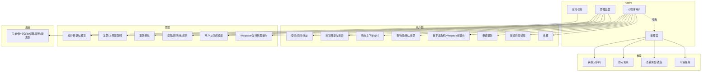

# 用例图

角色 × 能力矩阵。泳道职责见 [`BUSINESS-FLOWS.md`](./BUSINESS-FLOWS.md)，调用细节见 [`SEQUENCES.md`](./SEQUENCES.md)。

## 参与者

| 角色 | 说明 |
|------|------|
| 小程序用户 | 浏览、下单、履约查询、推荐 |
| 推荐官 | 分享获客、看佣金、提现（用户分层后的能力） |
| 管理运营 | 商品/订单/退款/履约/推荐审批 |
| 系统定时任务 | 同进程 Scheduler（非真人角色） |
| 外部平台 | 微信 / 顺丰 / Wespace / WMS / art_vision |

## 总图

## 用例表（按角色）

### 小程序用户

| 用例 | 主要 API / 面 |
|------|----------------|
| 登录刷新 | `/api/wx/login` · `/refresh` |
| 资料手机实名 | `/api/wx/*` bind / phone / realname |
| 地址簿 | `/api/wx/addresses` |
| 浏览原作/数字/权益/展览 | `/api/original-artworks` 等 |
| 加购结算支付 | `/api/cart` · `/api/wx/pay/*` |
| 订单与退款 | 订单列表详情 · `/refund` |
| 物流查询 | `/api/wx/logistics*` |
| 数字领取文案/资产 | `/api/digital-claim-copy` · user assets |
| Wespace 购买 | `digital-artworks/order/purchase` + webview |
| 扫画识图 | `POST /api/exhibitions/:id/visual-search` |
| 收藏搜索 | `/api/favorites` · `/api/search` |

### 推荐官

| 用例 | 主要 API |
|------|----------|
| 分享码 / 海报事件 | `/api/wx/referral/code` · share |
| 绑定（登录或显式） | `/api/wx/referral/bind` |
| 中心数据 | referral 中心接口 |
| 提现 | `/api/wx/referral/withdraw` |

### 管理运营

| 用例 | 主要面 |
|------|--------|
| 登录 | `/api/auth/login` |
| 目录 CRUD | artists / artworks / digital / rights / exhibitions / banners… |
| 订单发货 | `POST /api/wx/logistics/orders`（顺丰）· `POST /api/wx/logistics/manual-shipment`（手工） |
| 上传数字码 | `PATCH .../items/:id/qr-code` |
| 退款审批 | `/api/wx/pay/refund/approve` 等 |
| 推荐运营 | `/api/admin/referral/*` |
| 微信用户 | `/api/admin/wx-users` |
| 外部发行/资产 | `/api/external` · `/issuance` · asset-* |

### 系统定时

关未支付单 · 支付催付 · 物流轨迹通知 · 佣金结算 · 推荐对账 · 数字品/WMS 同步 · 展览识图索引。

## include / extend（简述）

- **下单支付** include：鉴权、计价、锁库存、可选券与推荐归因。
- **支付成功** extend：订阅消息、佣金 pending、数字所有权行、取消催付。
- **退款成功** extend：还库存、取消佣金、删数字购买行、订单 `REFUND`。
- **提现** include：钱包可用余额；extend：微信转账回调终态。
