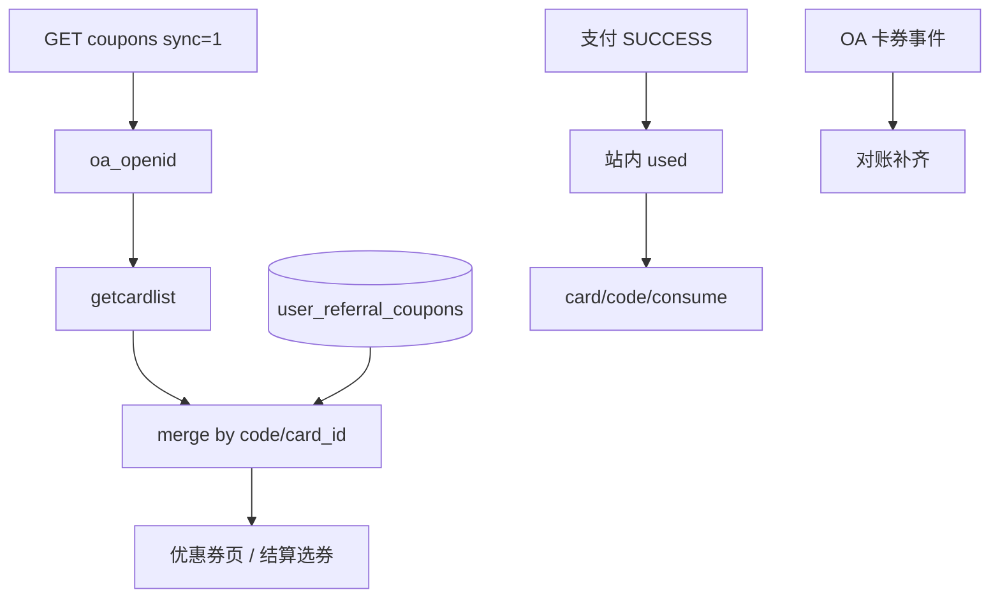

# 微信卡券双账本接入方案

站内推荐券（`user_referral_coupons`）与微信卡包打通：进卡包、列表以卡券为准合并、结算支付主核销并对账。

相关文档：

- [卡券须知](https://developers.weixin.qq.com/doc/service/guide/product/card/WeChat_Coupon_Interface.html)
- [创建卡券](https://developers.weixin.qq.com/doc/service/guide/product/card/Create_a_Coupon_Voucher_or_Card.html)
- [投放](https://developers.weixin.qq.com/doc/service/guide/product/card/Distributing_Coupons_Vouchers_and_Cards.html)
- [核销](https://developers.weixin.qq.com/doc/service/guide/product/card/Redeeming_a_coupon_voucher_or_card.html)
- [管理 / getcardlist](https://developers.weixin.qq.com/doc/service/guide/product/card/Managing_Coupons_Vouchers_and_Cards.html)
- [事件推送](https://developers.weixin.qq.com/doc/service/guide/product/card/Coupons_Vouchers_and_Cards_Event_Push_Messages.html)
- [卡券-小程序打通](https://developers.weixin.qq.com/doc/service/guide/product/card/Coupons-Mini_Program_Start_Up.html)
- [`wx.addCard`](https://developers.weixin.qq.com/miniprogram/dev/api/open-api/card/wx.addCard.html) / [`wx.openCard`](https://developers.weixin.qq.com/miniprogram/dev/api/open-api/card/wx.openCard.html)

## 1. 产品原则

| 项 | 规则 |
|----|------|
| 持有关系 | 以微信卡包为准（`card/user/getcardlist`） |
| 价格与结算占用 | 以站内 `user_referral_coupons` 为准 |
| 列表 | 微信列表 ∪ 站内未进包券，按 code/`card_id` 合并 |
| 核销主路径 | 小程序结算支付成功 → 站内 `used` → `card/code/consume` |
| 对账 | 卡券事件 + 定时任务；异常路径告警 |



## 2. 账号前提（实施前检查清单）

- [ ] 认证小程序 + 认证服务号（已开卡券）
- [ ] 二者绑定同一微信开放平台（可拿到 `unionid`）
- [ ] 服务号事件推送 URL 指向本服务（见 P0）
- [ ] `api_ticket` / 建卡使用**服务号** `access_token`（非小程序）
- [ ] 沙箱/白名单可先测未审核卡券

## 3. DDL 草案

在现有 `referralRewardsSchema` 迁移风格下增量执行（勿手改生产库，走启动 ensure / migration）。

### 3.1 `wx_users`

```sql
ALTER TABLE wx_users
  ADD COLUMN unionid VARCHAR(64) NULL COMMENT '开放平台 unionid' AFTER openid,
  ADD COLUMN oa_openid VARCHAR(64) NULL COMMENT '服务号 openid，卡券 getcardlist 用' AFTER unionid,
  ADD UNIQUE KEY uk_wx_users_unionid (unionid),
  ADD KEY idx_wx_users_oa_openid (oa_openid);
```

说明：登录 `jscode2session` 若返回 `unionid` 则落库；`oa_openid` 来自卡券领取事件或后续 OA 授权补齐。

### 3.2 `referral_coupon_templates`

```sql
ALTER TABLE referral_coupon_templates
  ADD COLUMN wx_card_id VARCHAR(64) NULL COMMENT '微信卡券 card_id' AFTER is_active,
  ADD COLUMN wx_card_status VARCHAR(32) NOT NULL DEFAULT 'none'
    COMMENT 'none|creating|approved|rejected|deleted' AFTER wx_card_id,
  ADD COLUMN wx_sync_enabled TINYINT(1) NOT NULL DEFAULT 0 AFTER wx_card_status,
  ADD COLUMN wx_logo_url VARCHAR(512) NULL AFTER wx_sync_enabled,
  ADD COLUMN wx_brand_name VARCHAR(36) NULL AFTER wx_logo_url,
  ADD COLUMN wx_color VARCHAR(16) NULL AFTER wx_brand_name,
  ADD COLUMN wx_quantity INT UNSIGNED NULL COMMENT '微信侧库存快照' AFTER wx_color,
  ADD UNIQUE KEY uk_referral_tpl_wx_card_id (wx_card_id);
```

### 3.3 `user_referral_coupons`

```sql
ALTER TABLE user_referral_coupons
  ADD COLUMN wx_card_id VARCHAR(64) NULL AFTER template_id,
  ADD COLUMN wx_code VARCHAR(32) NULL COMMENT '微信真实 code，对账主键' AFTER wx_card_id,
  ADD COLUMN wx_mp_openid VARCHAR(64) NULL AFTER wx_code,
  ADD COLUMN wx_oa_openid VARCHAR(64) NULL AFTER wx_mp_openid,
  ADD COLUMN wx_wallet_status VARCHAR(32) NOT NULL DEFAULT 'not_added'
    COMMENT 'not_added|pending_add|in_wallet|consumed|deleted|consume_failed' AFTER wx_oa_openid,
  ADD COLUMN wx_added_at DATETIME NULL AFTER wx_wallet_status,
  ADD COLUMN wx_consumed_at DATETIME NULL AFTER wx_added_at,
  ADD COLUMN wx_last_error VARCHAR(255) NULL AFTER wx_consumed_at,
  ADD COLUMN wx_consume_retry_count INT UNSIGNED NOT NULL DEFAULT 0 AFTER wx_last_error,
  ADD UNIQUE KEY uk_urc_wx_code (wx_code),
  ADD KEY idx_urc_wx_card_code (wx_card_id, wx_code),
  ADD KEY idx_urc_wallet_status (wx_wallet_status);
```

发券时生成 `wx_code`（建议 `RC` + 无连字符短 UUID，≤20 字符，满足卡券 code 长度习惯）。自定义 code 卡券：`use_custom_code=true`。

### 3.4 新表 `wx_card_event_log`

```sql
CREATE TABLE IF NOT EXISTS wx_card_event_log (
  id BIGINT UNSIGNED NOT NULL AUTO_INCREMENT,
  event_type VARCHAR(64) NOT NULL COMMENT 'user_get_card|user_consume_card|user_del_card|card_pass_check|...',
  card_id VARCHAR(64) NULL,
  code VARCHAR(32) NULL,
  oa_openid VARCHAR(64) NULL,
  outer_str VARCHAR(128) NULL,
  coupon_id BIGINT UNSIGNED NULL COMMENT '对齐后的 user_referral_coupons.id',
  raw_body MEDIUMTEXT NOT NULL,
  process_status VARCHAR(16) NOT NULL DEFAULT 'pending' COMMENT 'pending|done|ignored|failed',
  process_error VARCHAR(255) NULL,
  processed_at DATETIME NULL,
  created_at DATETIME NOT NULL DEFAULT CURRENT_TIMESTAMP,
  PRIMARY KEY (id),
  KEY idx_wcel_event_code (event_type, code),
  KEY idx_wcel_status (process_status, created_at)
) ENGINE=InnoDB DEFAULT CHARSET=utf8mb4;
```

### 3.5 新表 `wx_card_sync_jobs`

```sql
CREATE TABLE IF NOT EXISTS wx_card_sync_jobs (
  id BIGINT UNSIGNED NOT NULL AUTO_INCREMENT,
  job_type VARCHAR(32) NOT NULL COMMENT 'consume|reconcile|create_card|unavailable',
  coupon_id BIGINT UNSIGNED NULL,
  card_id VARCHAR(64) NULL,
  code VARCHAR(32) NULL,
  payload_json JSON NULL,
  status VARCHAR(16) NOT NULL DEFAULT 'pending' COMMENT 'pending|running|done|failed',
  attempts INT UNSIGNED NOT NULL DEFAULT 0,
  next_run_at DATETIME NOT NULL DEFAULT CURRENT_TIMESTAMP,
  last_error VARCHAR(255) NULL,
  created_at DATETIME NOT NULL DEFAULT CURRENT_TIMESTAMP,
  updated_at DATETIME NOT NULL DEFAULT CURRENT_TIMESTAMP ON UPDATE CURRENT_TIMESTAMP,
  PRIMARY KEY (id),
  KEY idx_wcsj_poll (status, next_run_at),
  KEY idx_wcsj_coupon (coupon_id)
) ENGINE=InnoDB DEFAULT CHARSET=utf8mb4;
```

## 4. 合并列表算法

`GET /api/wx/referral/coupons?status=&sync=1`

1. 取当前用户；无 `oa_openid` → 降级只读站内 + `wallet_sync: unavailable`。
2. `POST card/user/getcardlist`（openid = `oa_openid`；可选按模板 `wx_card_id` 过滤）。
3. 对每个 `{ card_id, code }`：
   - 命中本地 `wx_code` → 更新 `wx_wallet_status=in_wallet`（若仍为 not_added/deleted）。
   - 未命中 → 按 `card_id` 找模板，**补建** `user_referral_coupons`（source=`wx_wallet_import`）。
4. 并上「站内有、微信列表无」且 status 仍可用的行 → `need_add_card=true`。
5. 对状态不明且需要展示的少量 code，可选 `card/code/get` 校正过期/已核销。
6. 用站内 `status` + 微信态过滤；返回字段包含：

```json
{
  "id": 1,
  "title": "...",
  "discount_yuan": "20.00",
  "min_order_yuan": "100.00",
  "status": "available",
  "expires_at": "...",
  "wx_card_id": "p...",
  "wx_code": "RC...",
  "in_wallet": true,
  "can_checkout": true,
  "need_add_card": false,
  "wallet_sync": "ok"
}
```

结算选券与优惠券页共用同一 service（禁止两边各查各的）。

短缓存：同用户 `sync=1` 结果缓存 30–60s；下拉刷新带 `sync=1&force=1`。

## 5. 分期任务清单

### P0 基建（约 3–5 人日） — ✅ 已落地代码

| ID | 任务 | 落点 | 完成标准 |
|----|------|------|----------|
| P0-1 | 环境变量：服务号 `WECHAT_OA_APPID/SECRET`；`WECHAT_OA_TOKEN/AES_KEY` | `env.example` · `deploy/CI-CD.md` | 配置齐全后可拿 OA access_token |
| P0-2 | OA `access_token` 缓存 + `api_ticket`（卡券）缓存 | `services/wechatOaTokenService.js` | Redis 缓存 + 单飞 |
| P0-3 | `wx_users.unionid` / `oa_openid` 列 + 登录写入 unionid | `utils/wxCardSchema.js` · `wxService` | 开放平台已绑时登录落 unionid |
| P0-4 | 服务号回调 `GET|POST /api/wx/oa/callback` | `routes/wxOa.js` · `wxCardEventService` | 微信后台验证 URL；事件 ACK `success` |
| P0-5 | 事件落库 `wx_card_event_log`（先存后处理） | 同上 | 领券等事件入库 `pending` |
| P0-6 | 文档：更新 `INTEGRATIONS.md` 入站表 | `docs/INTEGRATIONS.md` | 回调路径已登记 |

**上线前运维**：公众平台将服务器 URL 设为 `https://<api-host>/api/wx/oa/callback`，填入与 `WECHAT_OA_TOKEN`（及安全模式 `AES_KEY`）一致的值；小程序与服务号绑定同一开放平台。

### P1 进卡包 + 列表合并（约 5–7 人日） — ✅ 已落地代码

| ID | 任务 | 落点 | 完成标准 |
|----|------|------|----------|
| P1-1 | 模板 DDL + Admin：绑定/创建/刷新 `wx_card_id` | `referralRewardsSchema` · `adminReferral` · `ReferralCoupons.vue` | 后台可创建微信卡 / 刷新状态 |
| P1-2 | 创建卡券封装（CASH、自定义 code、跳转小程序 cell） | `services/wxCardService.js` | 创建后写入 `wx_card_id` |
| P1-3 | 发券时生成 `wx_code`，写 `wx_card_id` | `referralRewardService` | 新人礼/后台发放均有 code |
| P1-4 | `GET .../coupons/:id/card-ext`：签 cardExt | `routes/referral.js` + `wxCardService` | 签名用服务号 api_ticket |
| P1-5 | `POST .../coupons/:id/card-added`：解码并绑定 | 同上 | `wx_wallet_status=in_wallet` |
| P1-6 | `user_get_card` / `card_pass_check` / `user_del_card` | `wxCardEventService` | 事件对齐本地券与模板状态 |
| P1-7 | 列表合并：`getcardlist` + 本地补建/并集 | `listUserCoupons(sync/force)` | 卡包有、本地无 → 补建可用 |
| P1-8 | 小程序：放入卡包 / 查看卡包 / 同步刷新 | `art_wx` coupons + referralApi | addCard/openCard |
| P1-9 | 卡面跳小程序：对齐 encrypt_code → 结算预选 | `wxCardLaunch.js` · App · checkout | 从卡包进结算可带券 |

**联调注意：** 需配置 `WX_CARD_DEFAULT_LOGO_URL`（或模板 `wx_logo_url`）、`WX_MP_GH_ID`；卡券审核通过后 `wx_card_status=approved` 方可稳定投放。

### P2 支付核销同步（约 3–4 人日）

| ID | 任务 | 落点（建议） | 完成标准 |
|----|------|--------------|----------|
| P2-1 | `wx_card_sync_jobs` + worker/cron 轮询 | `services/wxCardSyncWorker.js` | pending 任务可消费 |
| P2-2 | 支付 SUCCESS：`markReferralCouponUsed` 后 enqueue `consume` | `payService` | 站内 used 后必入队 |
| P2-3 | `card/code/consume`（自定义 code 带 card_id）+ 重试退避 | `wxCardService` | 成功 → `consumed`；失败 → `consume_failed` 可重试 |
| P2-4 | `user_consume_card`：幂等对齐；若站内仍 available → 冻结并告警 | `wxCardEventService` | 无双花窗口泄漏到可结算 |
| P2-5 | 取消/关单释放站内券时：微信已核销则禁止放回 available | `payService` / referral | 状态机一致 |

### P3 对账与运营（约 2–3 人日）

| ID | 任务 | 落点（建议） | 完成标准 |
|----|------|--------------|----------|
| P3-1 | 日对账：`used` 且未 `consumed` → 再 consume；微信已消站内未用 → 纠偏 | cron | 报表/日志可查差异数 |
| P3-2 | `user_del_card` → `deleted`；支持重新 addCard | 事件 + 列表 | 删卡不丢站内可用券 |
| P3-3 | Admin：同步失败列表、手动重试核销、强制 refresh getcardlist | Admin UI | 运营可自助处理 |
| P3-4 | 过期：站内 expire + 可选微信 `unavailable` | worker | 过期券两侧不可用 |
| P3-5 | 文档：补 `STATE-MACHINES.md` / `BUSINESS-FLOWS.md` / `DATA-MODEL.md` | docs | 与实现对齐 |
| P3-6 | 集成测试：签名、解码、合并、consume 幂等 | `tests/` | CI 可跑关键路径（mock 微信） |

## 6. API 一览

| Method | Path | 说明 |
|--------|------|------|
| POST | `/api/wx/oa/callback` | 服务号消息/卡券事件 |
| GET | `/api/wx/referral/coupons` | `sync`/`force` 合并列表 |
| GET | `/api/wx/referral/coupons/:id/card-ext` | addCard 参数 |
| POST | `/api/wx/referral/coupons/:id/card-added` | 领取结果回传 |
| POST | `/api/admin/referral/coupon-templates/:id/wx-card` | 创建/同步微信卡 |
| POST | `/api/admin/referral/coupons/:id/wx-consume-retry` | 手动重试核销 |
| GET | `/api/admin/referral/wx-card/reconcile-report` | 对账差异 |

既有：`POST .../coupons/grant`、checkout preview、支付 notify——行为扩展见 P2。

## 7. 环境变量草案

| 变量 | 用途 |
|------|------|
| `WECHAT_OA_APPID` / `WECHAT_OA_SECRET` | 服务号（已有模板消息可复用） |
| `WECHAT_OA_TOKEN` | 服务器配置 Token |
| `WECHAT_OA_AES_KEY` | 消息加解密 EncodingAESKey |
| `WECHAT_OA_CALLBACK_ENABLED` | 开关 |
| `WX_CARD_SYNC_ENABLED` | 卡券双账本总开关 |
| `WX_CARD_LIST_CACHE_SECONDS` | 列表合并缓存，默认 45 |
| `WX_MP_GH_ID` | 小程序原始 ID（卡面 `*_app_brand_user_name` = `{gh}@app`） |

## 8. 风险与降级

| 风险 | 处理 |
|------|------|
| 无 `oa_openid` | 列表降级站内；引导领券进包后由事件补齐 |
| getcardlist 超时 | 返回上次本地快照 + `wallet_sync: stale` |
| 支付已 used、微信 consume 失败 | 重试队列；用户卡包短暂仍可见，必须追上 |
| 用户仅在卡包领、本地无记录 | 合并时补建；缺模板则只展示不可结算 + 运营告警 |
| 老数据无 `wx_code` | 仅新发券强制；老券可选批量补码再引导 addCard |

## 9. 建议实施顺序

1. 完成账号检查清单 → P0  
2. 一模板一卡白名单联调 → P1  
3. 支付链路接 consume → P2  
4. 对账与后台工具 → P3  

**未完成 P0 的 oa_openid / 事件回调前，不要上线「列表以卡包为准」。**

---

状态：方案已确认，待排期开发（本文档为实施蓝图，不含业务代码）。
